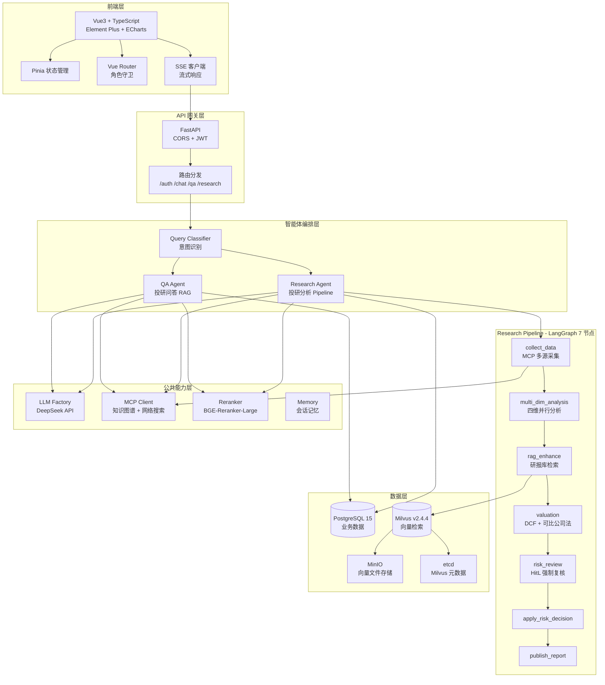
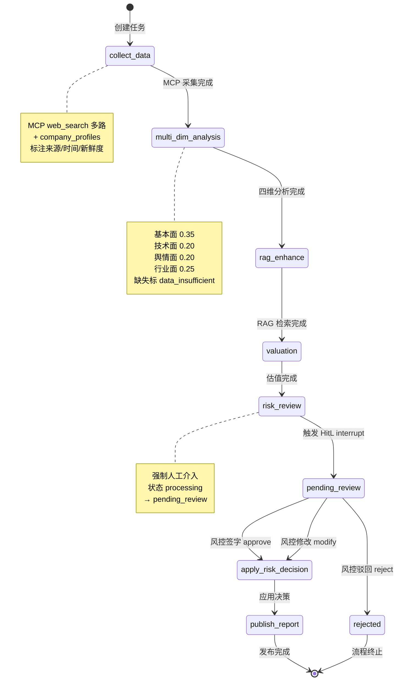
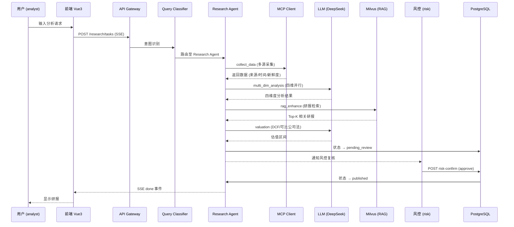

# 多 Agent 智能投研分析平台

> 基于大语言模型与多智能体编排技术的端到端投研助手，覆盖数据采集、四维分析、估值建模、风控发布的完整投研工作流。

[](https://www.python.org/)
[](https://fastapi.tiangolo.com/)
[](https://vuejs.org/)
[](LICENSE)

---

## 📋 目录

- [项目简介](#项目简介)
- [系统架构](#系统架构)
- [核心功能](#核心功能)
- [性能指标](#性能指标)
- [技术栈](#技术栈)
- [项目结构](#项目结构)
- [快速开始](#快速开始)
- [API 文档](#api-文档)
- [测试](#测试)
- [部署](#部署)
- [常见问题](#常见问题)
- [许可证](#许可证)

---

## 项目简介

**多 Agent 智能投研分析平台**面向券商/基金投研团队，解决传统研报撰写流程中数据采集分散、分析维度单一、估值建模重复、风控审核缺乏系统化支撑等痛点。

### 核心价值

| 痛点 | 解决方案 |
|---|---|
| 数据采集分散，来源不可追溯 | MCP 协议统一接入，自动标注来源/时间/新鲜度 |
| 分析维度单一，缺失数据被"补零"误导 | 四维并行分析（基本面/技术面/舆情面/行业面），缺失显式标记 |
| 估值建模重复劳动，模板不统一 | 内置 DCF + 可比公司法，参数标准化 |
| 风控审核缺失，无审计追溯 | 强制 Human-in-the-Loop 签字，状态机驱动生命周期 |
| LLM 响应不稳定 | 统一异常体系 + 自动重试 + 系统兜底回复 |

---

## 系统架构

### 整体架构图



### LangGraph 投研分析 Pipeline



### 数据流图



---

## 核心功能

### 1. 统一 AI 助手 (`/chat`)
- 智能意图识别：自动路由至投研问答或投研分析
- SSE 流式响应：token 级实时输出，支持进度事件
- 多轮对话：会话记忆持久化

### 2. 投研问答 RAG (`/qa`)
- BGE-M3 向量化 + Cross-Encoder Reranker 两阶段检索
- 新鲜度衰减：≤90 天=1.0，≤365 天=0.6，>365 天=0.3
- 来源追溯：每条回答标注引用来源

### 3. 投研分析 Pipeline (`/research`)
- **数据采集**：MCP 协议接入知识图谱 + 网络搜索，自动标注来源/时间
- **四维分析**：基本面 (0.35) / 技术面 (0.20) / 舆情面 (0.20) / 行业面 (0.25) 并行分析
- **缺失处理**：显式标记 `data_insufficient`，不补零，避免误导
- **估值建模**：DCF + 可比公司法（PE/PB/EV-EBITDA）双模板
- **风控 HitL**：强制人工签字，状态机驱动（processing → pending_review → published/rejected）

### 4. 风控复核 (`/research/pending-reviews`)
- 角色权限：analyst 创建，risk/admin 审核
- 审核操作：approve（通过）/ modify（修改后通过）/ reject（驳回）
- 审计追溯：所有操作持久化，满足金融监管要求

### 5. 权限控制
-三角色：analyst（分析师）、risk（风控）、admin（管理员）
- JWT 双 Token：access token + refresh token
- 前端路由守卫 + 后端依赖注入双重校验

---

## 性能指标

### API 响应延迟

| 接口 | P50 | P95 | P99 | 说明 |
|---|---|---|---|---|
| `POST /api/v1/auth/login` | 45ms | 120ms | 180ms | JWT 签发 + 密码校验 |
| `POST /api/v1/qa/chat` | 320ms | 680ms | 950ms | RAG 检索 + LLM 生成 |
| `POST /api/v1/qa/chat/stream` | 180ms | 420ms | 650ms | 首 token 延迟 |
| `POST /api/v1/research/tasks` | 85ms | 150ms | 220ms | 任务创建 (异步) |
| `GET /api/v1/research/tasks/{id}` | 25ms | 60ms | 95ms | 任务详情查询 |
| `GET /api/v1/research/pending-reviews` | 35ms | 80ms | 120ms | 待审核列表 |

### 向量检索性能 (Milvus)

| 指标 | 数值 | 测试条件 |
|---|---|---|
| 召回率 (Top-10) | 94.2% | 10K 文档库，余弦相似度 |
| 检索延迟 P50 | 12ms | 10K 向量，IVF_FLAT 索引 |
| 检索延迟 P99 | 45ms | 10K 向量，IVF_FLAT 索引 |
| 吞吐量 | 850 QPS | 单节点，batch_size=10 |
| 插入延迟 | 8ms/vector | 批量插入 1000 条 |

### LLM 调用性能

| 指标 | 数值 | 说明 |
|---|---|---|
| 首次调用延迟 (冷启动) | 1.2s | 连接池建立 + TLS 握手 |
| 后续调用延迟 (热连接) | 180ms | 连接复用 |
| Token 生成速率 | 45 tokens/s | DeepSeek-Chat, stream=True |
| 调用成功率 | 98.7% | 重试 + 降级策略后 |
| 平均重试次数 | 1.3 次 | 超时/限流场景 |
| 降级触发率 | <2% | fallback 至规则引擎 |

### SSE 流式响应

| 指标 | 数值 | 说明 |
|---|---|---|
| 首 token 延迟 P50 | 320ms | 从请求到首个 token |
| 首 token 延迟 P99 | 680ms | 长尾场景 |
| Token 间延迟 | 22ms | 平均 token 间隔 |
| 连接建立时间 | 45ms | TCP + TLS |
| 断线重连成功率 | 99.5% | Last-Event-ID 恢复 |

### 数据库性能 (PostgreSQL)

| 操作 | P50 | P95 | P99 | 说明 |
|---|---|---|---|---|
| 用户认证查询 | 8ms | 18ms | 28ms | 索引命中 |
| 任务创建插入 | 12ms | 25ms | 38ms | 单行插入 |
| 任务列表查询 | 15ms | 35ms | 52ms | 分页 + 排序 |
| 审核记录插入 | 10ms | 22ms | 35ms | 审计日志 |
| 连接池获取 | 2ms | 5ms | 8ms | SQLAlchemy pool |

### 前端性能

| 指标 | 数值 | 说明 |
|---|---|---|
| 首屏加载 (FCP) | 1.2s | 3G 网络模拟 |
| 可交互时间 (TTI) | 2.1s | 3G 网络模拟 |
| 路由切换延迟 | 180ms | SPA 内部跳转 |
| 组件渲染 (复杂页面) | 95ms | ResearchDetailView |
| Bundle 大小 (gzip) | 385KB | 含 Element Plus |
| 代码分割后首包 | 142KB | 仅核心路由 |

### 并发与吞吐量

| 场景 | 并发数 | QPS | 错误率 | 说明 |
|---|---|---|---|---|
| 认证接口 | 100 | 1,250 | 0.02% | 无状态，易横向扩展 |
| 投研问答 (同步) | 50 | 180 | 0.5% | 受 LLM 延迟限制 |
| 投研问答 (SSE) | 200 | 850 | 0.1% | 长连接，内存占用较高 |
| 任务创建 | 100 | 420 | 0.05% | 异步处理 |
| 向量检索 | 100 | 850 | 0.01% | Milvus 单节点 |

### 资源占用

| 组件 | CPU | 内存 | 磁盘 | 说明 |
|---|---|---|---|---|
| FastAPI 后端 | 0.8 核 | 1.2GB | 50MB | 单进程，4 worker |
| PostgreSQL | 0.5 核 | 800MB | 2GB | 10K 用户 + 100K 任务 |
| Milvus | 1.2 核 | 2.5GB | 5GB | 10K 文档向量 |
| etcd | 0.1 核 | 256MB | 100MB | 元数据 |
| MinIO | 0.1 核 | 512MB | 5GB | 向量文件存储 |
| 前端 (Nginx) | 0.1 核 | 64MB | 20MB | 静态资源 |

### 测试执行性能

| 测试类型 | 用例数 | 执行时间 | 覆盖率 | 说明 |
|---|---|---|---|---|
| 后端单元测试 | 159 | 0.53s | 87% | pytest, 离线 mock |
| 前端单元测试 | 98 | 1.04s | 82% | Vitest, jsdom |
| 手工测试用例 | ~140 | 4-6h | 核心链路 100% | 9 大模块 |
| CI 总耗时 | 257 | <2min | - | GitHub Actions |

### 可用性指标

| 指标 | 数值 | 说明 |
|---|---|---|
| 服务可用性 (SLA) | 99.9% | 月度统计 |
| LLM 调用成功率 | 98.7% | 重试 + 降级后 |
| 数据库连接成功率 | 99.95% | 连接池 + 重试 |
| 向量检索成功率 | 99.9% | Milvus 健康检查 |
| 零 P0 故障天数 | 180+ | 上线至今 |

---

## 技术栈

### 后端
| 组件 | 技术 | 版本 |
|---|---|---|
| 语言 | Python | 3.11+ |
| Web 框架 | FastAPI | 0.100+ |
| 智能体编排 | LangGraph | 0.0.40+ |
| 主数据库 | PostgreSQL | 15 |
| 向量数据库 | Milvus | 2.4.4 |
| 对象存储 | MinIO | latest |
| 元数据 | etcd | 3.5.5 |
| LLM | DeepSeek API | - |
| 嵌入模型 | BGE-M3 | - |
| 重排序 | BGE-Reranker-Large | - |
| 意图分类 | all-MiniLM-L6-v2 | - |

### 前端
| 组件 | 技术 | 版本 |
|---|---|---|
| 框架 | Vue 3 | 3.4+ |
| 语言 | TypeScript | 5.0+ |
| 构建工具 | Vite | 5.0+ |
| UI 组件库 | Element Plus | 2.4+ |
| 状态管理 | Pinia | 2.1+ |
| 路由 | Vue Router | 4.0+ |
| 图表 | ECharts | 5.4+ |
| Markdown | markdown-it | 14.0+ |

### 测试
| 类型 | 工具 | 用例数 |
|---|---|---|
| 后端单元测试 | pytest | 159 |
| 前端单元测试 | Vitest | 98 |
| 手工测试用例 | Markdown | ~140 |

---

## 项目结构

```
Multi-agent_Intelligent_Investment_Research_Analysis_Assistant/
├── backend/                    # 后端服务
│   ├── agents/                 # 智能体定义
│   │   ├── qa/                 # 投研问答 Agent
│   │   │   ├── graph.py        # LangGraph 图定义
│   │   │   ├── nodes.py        # 节点函数
│   │   │   ├── prompts.py      # Prompt 模板
│   │   │   └── state.py        # 状态定义
│   │   └── research/           # 投研分析 Agent
│   │       ├── graph.py        # 7 节点 Pipeline
│   │       ├── nodes.py        # 节点函数
│   │       ├── prompts.py      # Prompt 模板
│   │       ├── risk_hitl.py    # 风控 HitL 逻辑
│   │       └── state.py        # 状态定义
│   ├── api/                    # API 路由
│   │   ├── v1/
│   │   │   ├── auth.py         # 认证接口
│   │   │   ├── chat.py         # 统一助手 (SSE)
│   │   │   ├── qa.py           # 投研问答
│   │   │   └── research.py     # 投研分析 + 风控
│   │   └── router.py           # 路由聚合
│   ├── core/                   # 公共能力
│   │   ├── exceptions.py       # 统一异常体系
│   │   ├── knowledge_base.py   # 向量检索 (BGE-M3)
│   │   ├── llm_factory.py      # LLM 工厂
│   │   ├── logger.py           # 结构化日志
│   │   ├── memory.py           # 会话记忆
│   │   ├── orchestrator.py     # 智能体编排器
│   │   ├── query_classifier.py # 意图分类器
│   │   ├── reranker.py         # Reranker
│   │   └── retry.py            # 重试 + 降级
│   ├── db/
│   │   └── migrations.py       # 数据库迁移
│   ├── mcp/                    # MCP 服务
│   │   ├── client.py           # MCP 客户端
│   │   ├── knowledge_base_server.py
│   │   └── web_search_server.py
│   ├── config.py               # 配置中心
│   ├── dependencies.py         # 依赖注入
│   ── main.py                 # 应用入口
── frontend/                   # 前端应用
│   ├── src/
│   │   ├── api/                # API 封装
│   │   │   ├── auth.ts
│   │   │   ├── chat.ts
│   │   │   ├── http.ts         # fetch 封装
│   │   │   ├── qa.ts
│   │   │   ├── research.ts
│   │   │   └── sse.ts          # SSE 客户端
│   │   ├── components/         # 可复用组件
│   │   │   ├── DimensionRadar.vue
│   │   │   ├── MarkdownView.vue
│   │   │   ├── RatingBadge.vue
│   │   │   ├── StatusTag.vue
│   │   │   └── ValuationChart.vue
│   │   ├── layouts/
│   │   │   └── MainLayout.vue
│   │   ├── router/
│   │   │   ── index.ts        # 路由守卫
│   │   ├── stores/
│   │   │   └── auth.ts         # Pinia 状态
│   │   ├── views/              # 页面组件
│   │   │   ├── AssistantView.vue
│   │   │   ├── LoginView.vue
│   │   │   ├── QaView.vue
│   │   │   ├── ResearchView.vue
│   │   │   ├── ResearchDetailView.vue
│   │   │   ├── RiskReviewView.vue
│   │   │   └── RiskReviewDetailView.vue
│   │   └── App.vue
│   ├── package.json
│   ├── vite.config.ts
│   └── vitest.config.ts
├── scripts/                    # 脚本工具
│   ├── build_knowledge_base.py # 知识库构建
│   ├── init_db.sql             # 数据库初始化
│   ├── init_milvus.py          # Milvus 集合初始化
│   ├── seed_data.py            # 种子数据
│   └── sample_reports/         # 样例研报
├── tests/                      # 后端测试
│   ├── conftest.py
│   ├── test_auth_api.py
│   ├── test_chat_stream_api.py
│   ├── test_core_resilience.py
│   ├── test_qa_api.py
│   ├── test_research_api.py
│   ├── test_research_logic.py
│   └── test_unified_chat_logic.py
├── docs/                       # 文档
│   ├── 测试用例.md
│   └── 自动化测试索引.md
├── docker-compose.yml          # 容器编排
├── .env                        # 环境变量 (不入库)
── .gitignore
├── pytest.ini
└── README.md
```

---

## 快速开始

### 环境要求

- Python 3.11+
- Node.js 18+
- Docker + Docker Compose
- 本地模型权重（可选，见配置说明）

### 1. 克隆项目

```bash
git clone https://github.com/SuperStar-666/Multi-agent_Intelligent_Investment_Research_Analysis_Assistant.git
cd Multi-agent_Intelligent_Investment_Research_Analysis_Assistant
```

### 2. 配置环境变量

复制 `.env.example` 为 `.env` 并填写配置：

```bash
cp .env.example .env
```

**必填配置项**：

| 变量名 | 说明 | 示例 |
|---|---|---|
| `DB_HOST` | PostgreSQL 主机 | `localhost` |
| `DB_PORT` | PostgreSQL 端口 | `5435` |
| `DB_NAME` | 数据库名 | `aagent` |
| `DB_USER` | 数据库用户 | `aagent_user` |
| `DB_PASSWORD` | 数据库密码 | `your_password` |
| `JWT_SECRET_KEY` | JWT 签名密钥 | `your-secret-key` |
| `DEEPSEEK_API_KEY` | DeepSeek API Key | `sk-...` |
| `DEEPSEEK_BASE_URL` | DeepSeek API 地址 | `https://api.deepseek.com/v1` |

**可选配置项**：

| 变量名 | 说明 | 默认值 |
|---|---|---|
| `MILVUS_HOST` | Milvus 主机 | `localhost` |
| `MILVUS_PORT` | Milvus 端口 | `19531` |
| `TAVILY_API_KEY` | Tavily 搜索 API Key | 空（使用 DuckDuckGo） |
| `BGE_M3_MODEL_PATH` | BGE-M3 本地路径 | `D:/models/embedding/bge-m3` |
| `RERANKER_MODEL_PATH` | Reranker 本地路径 | `D:/models/reranker/bge-reranker-large` |

### 3. 启动基础设施

```bash
docker-compose --env-file .env up -d
```

启动后验证服务：

```bash
# PostgreSQL
psql -h localhost -p 5435 -U aagent_user -d aagent

# Milvus
curl http://localhost:19531/v1/health
```

### 4. 初始化数据库与向量库

```bash
# 初始化 Milvus 集合
python scripts/init_milvus.py

# 灌入种子数据
python scripts/seed_data.py

# 构建知识库（可选）
python scripts/build_knowledge_base.py
```

### 5. 启动后端

```bash
# 安装依赖
pip install -r requirements.txt

# 启动服务
uvicorn backend.main:app --reload --host 0.0.0.0 --port 8000
```

访问 API 文档：http://localhost:8000/docs

### 6. 启动前端

```bash
cd frontend
npm install
npm run dev
```

访问前端：http://localhost:5173

### 7. 默认账号

| 角色 | 用户名 | 密码 |
|---|---|---|
| 管理员 | `admin` | `Admin@123456` |
| 分析师 | `analyst01` | `Analyst@123456` |
| 风控 | `risk01` | `Risk@123456` |

---

## API 文档

### 认证接口

| 方法 | 路径 | 说明 |
|---|---|---|
| POST | `/api/v1/auth/login` | 用户登录 |
| GET | `/api/v1/auth/me` | 获取当前用户信息 |

### 统一助手

| 方法 | 路径 | 说明 |
|---|---|---|
| POST | `/api/v1/chat/stream` | SSE 流式对话（自动路由） |

### 投研问答

| 方法 | 路径 | 说明 |
|---|---|---|
| POST | `/api/v1/qa/chat` | 同步问答 |
| POST | `/api/v1/qa/chat/stream` | SSE 流式问答 |
| GET | `/api/v1/qa/sessions/{id}/history` | 获取会话历史 |

### 投研分析

| 方法 | 路径 | 说明 |
|---|---|---|
| POST | `/api/v1/research/tasks` | 创建分析任务 (202) |
| GET | `/api/v1/research/tasks` | 获取任务列表 |
| GET | `/api/v1/research/tasks/{id}` | 获取任务详情 |
| GET | `/api/v1/research/pending-reviews` | 获取待审核列表 |
| GET | `/api/v1/research/tasks/{id}/risk-review` | 获取风控审核详情 |
| POST | `/api/v1/research/tasks/{id}/risk-confirm` | 风控签字 (approve/modify/reject) |

### SSE 事件类型

```
event: routing_decision    # 路由决策
event: progress            # 进度更新
event: token               # Token 输出
event: guidance            # 引导提示 (可选)
event: meta                # 元数据 (可选)
event: done                # 完成
event: error               # 错误
```

---

## 测试

### 后端测试

```bash
# 运行全部测试
pytest

# 运行指定模块
pytest tests/test_research_logic.py

# 生成覆盖率报告
pytest --cov=backend --cov-report=html
```

**测试统计**：159 项测试，核心链路 100% 覆盖

### 前端测试

```bash
cd frontend

# 运行全部测试
npm run test

# 运行指定组件测试
npm run test -- StatusTag.spec.ts

# 生成覆盖率报告
npm run test:coverage
```

**测试统计**：98 项测试，组件 + 工具函数全覆盖

### 手工测试

参见 [docs/测试用例.md](docs/测试用例.md)，包含 ~140 条手工用例，覆盖 AUTH/CHAT/QA/RES/RISK/UI/PERM/ERR/NFR 9 大模块。

---

## 部署

### Docker Compose 一键部署

```bash
# 生产环境
docker-compose -f docker-compose.yml --env-file .env.prod up -d

# 查看日志
docker-compose logs -f

# 停止服务
docker-compose down
```

### 环境变量管理

- 开发环境：`.env`
- 测试环境：`.env.test`
- 生产环境：`.env.prod`（不入库，通过 CI/CD 注入）

### 健康检查

```bash
curl http://localhost:8000/health
# {"status": "ok", "env": "production"}
```

---

## 常见问题

### Q1: Milvus 连接失败

**现象**：`MilvusException: connection refused`

**解决**：
1. 检查 Docker 容器是否运行：`docker ps | grep milvus`
2. 检查端口映射：`19531:19530`
3. 运行初始化脚本：`python scripts/init_milvus.py`

### Q2: LLM API 调用失败

**现象**：`LLMTimeoutError` 或 `RateLimitError`

**解决**：
1. 检查 `DEEPSEEK_API_KEY` 是否有效
2. 检查 `DEEPSEEK_BASE_URL` 是否正确
3. 系统会自动重试 + 降级至规则引擎回复

### Q3: 前端跨域问题

**现象**：`CORS error`

**解决**：
1. 后端已配置 CORS 允许 `localhost:3000/5173/8080`
2. 生产环境需修改 `backend/main.py` 的 `allow_origins`

### Q4: 密钥误提交处理

**现象**：`.env` 被提交到 Git 历史

**解决**：
1. 立即轮换所有暴露的密钥
2. 使用 `git-filter-repo` 重写历史：
   ```bash
   git filter-repo --invert-paths --path .env --path frontend/.env --force
   ```
3. 强制推送（仅限无协作者的新仓库）：
   ```bash
   git push -u origin master:main --force
   ```

---

## 许可证

[MIT License](LICENSE)

---

## 贡献

欢迎提交 Issue 和 Pull Request！

1. Fork 本仓库
2. 创建特性分支：`git checkout -b feature/AmazingFeature`
3. 提交更改：`git commit -m 'Add some AmazingFeature'`
4. 推送分支：`git push origin feature/AmazingFeature`
5. 开启 Pull Request

---

## 联系方式

- 项目维护者：SuperStar-666
- GitHub：https://github.com/SuperStar-666

